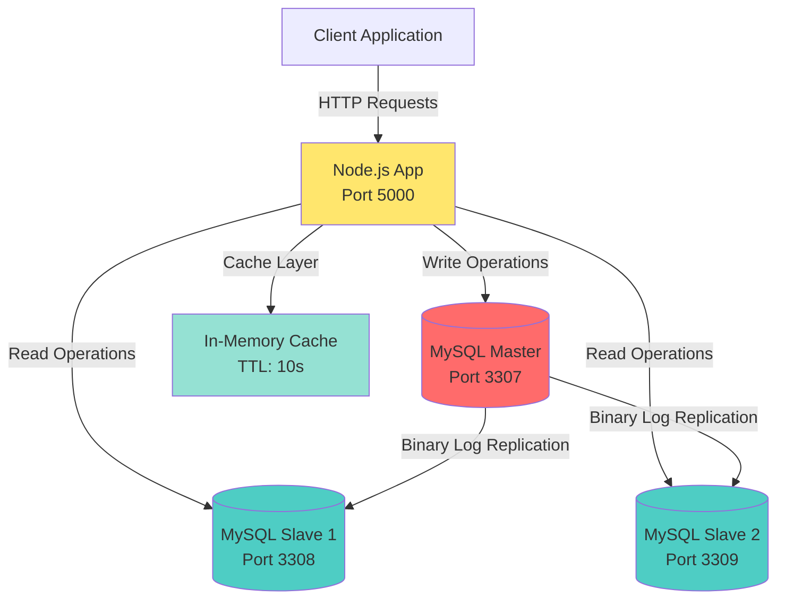
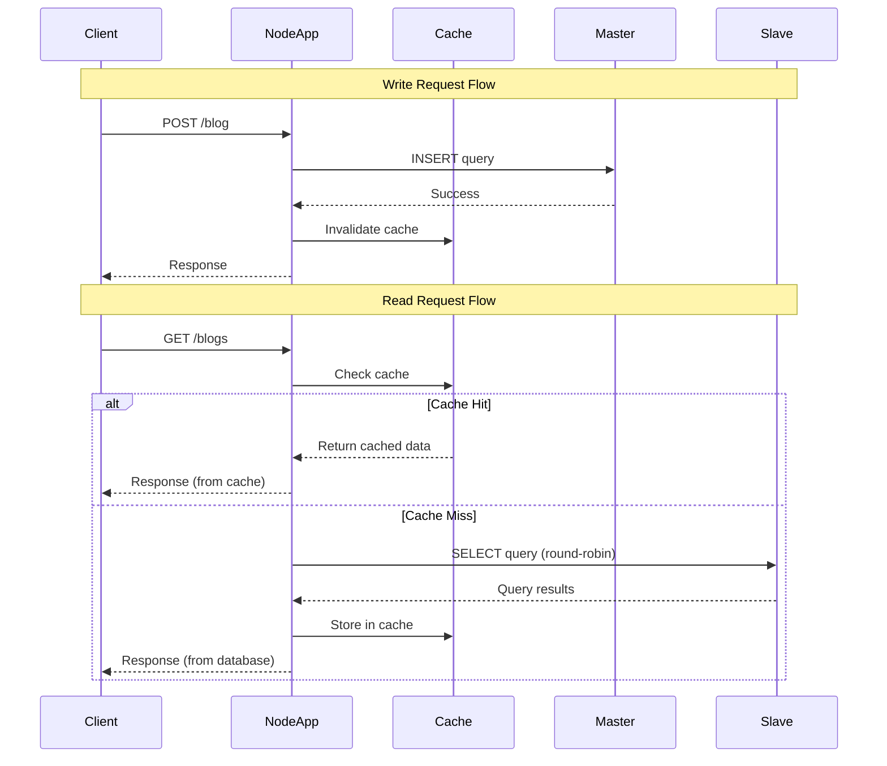
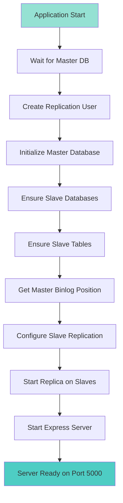

# Blog Backend with MySQL Master-Slave Replication

A production-ready Node.js and Express backend application demonstrating MySQL master-slave replication architecture with read/write splitting, in-memory caching, and automatic replication setup. The application is fully containerized using Docker and Docker Compose.

## Table of Contents

- [Features](#features)
- [Architecture](#architecture)
- [Prerequisites](#prerequisites)
- [Installation](#installation)
- [Configuration](#configuration)
- [API Endpoints](#api-endpoints)
- [How It Works](#how-it-works)
- [Project Structure](#project-structure)
- [Usage Examples](#usage-examples)
- [Troubleshooting](#troubleshooting)
- [License](#license)

## Features

- **Master-Slave Replication**: Automatic MySQL replication setup with GTID support
- **Read/Write Splitting**: Writes go to master, reads are distributed across slaves using round-robin
- **In-Memory Caching**: TTL-based cache layer to reduce database load
- **Automatic Setup**: Self-configuring replication on application startup
- **Dockerized**: Complete containerization with Docker Compose
- **Health Checks**: Built-in health checks for database containers
- **Pagination Support**: Efficient pagination for blog listings
- **Auto-Reload**: Development-friendly with nodemon for hot reloading

## Architecture

### System Architecture



### Request Flow



### Replication Setup Flow



## Prerequisites

- Docker (version 20.10 or higher)
- Docker Compose (version 2.0 or higher)
- Node.js 18+ (for local development, optional)
- pnpm (installed globally or via Docker)

## Installation

### Using Docker Compose (Recommended)

1. Clone the repository:
```bash
git clone https://github.com/Tim-Alpha/blog-backend.git
cd blog-backend
```

2. Build and start all services:
```bash
docker-compose up --build
```

This command will:
- Build the Node.js application container
- Start MySQL master container (port 3307)
- Start two MySQL slave containers (ports 3308, 3309)
- Automatically configure replication
- Start the Express server on port 5000

3. Verify the setup:
```bash
docker-compose ps
```

All containers should be in a healthy state.

### Local Development

If you prefer to run the application locally:

1. Install dependencies:
```bash
pnpm install
```

2. Ensure MySQL instances are running and update `config.js` with your connection details

3. Start the server:
```bash
pnpm run test
```

## Configuration

### Database Configuration

Edit `config.js` to modify database connections:

```javascript
export default {
  master: {
    host: 'mysql-master',
    user: 'root',
    password: 'root',
    database: 'blogdb',
    port: 3306,
  },
  slaves: [
    {
      host: 'mysql-slave1',
      user: 'root',
      password: 'root',
      database: 'blogdb',
      port: 3306,
    },
    // Add more slaves as needed
  ],
};
```

### Docker Compose Configuration

The `docker-compose.yml` file defines:
- **MySQL Master**: Server ID 1, binary logging enabled, GTID mode ON
- **MySQL Slaves**: Server IDs 2 and 3, read-only mode, GTID mode ON
- **Node App**: Auto-reload enabled with volume mounting

### Cache Configuration

Cache TTL is set to 10 seconds in `server.js`:
```javascript
const CACHE_TTL = 10 * 1000; // 10 seconds
```

Modify this value to adjust cache expiration time.

## API Endpoints

### Create Blog Post

**POST** `/blog`

Creates a new blog post. Write operation goes to the master database.

**Request Body:**
```json
{
  "title": "My First Blog Post",
  "content": "This is the content of my blog post",
  "author": "John Doe"
}
```

**Response:**
```json
{
  "message": "Blog created successfully"
}
```

### Get Blog Posts

**GET** `/blogs?page=1&limit=5`

Retrieves paginated blog posts. Read operation uses round-robin across slave databases.

**Query Parameters:**
- `page` (optional): Page number (default: 1)
- `limit` (optional): Number of posts per page (default: 5)

**Response:**
```json
{
  "source": "mysql-slave1",
  "page": 1,
  "limit": 5,
  "size": 5,
  "blogs": [
    {
      "id": 1,
      "title": "My First Blog Post",
      "content": "This is the content",
      "author": "John Doe",
      "created_at": "2024-01-01T00:00:00.000Z"
    }
  ]
}
```

**Note:** The `source` field indicates where the data was fetched from (`cache`, `mysql-slave1`, or `mysql-slave2`).

### Delete Blog Post

**DELETE** `/blog/:id`

Deletes a blog post by ID. Write operation goes to the master database.

**Response:**
```json
{
  "message": "Blog deleted successfully"
}
```

## How It Works

### Read/Write Splitting

- **Write Operations** (POST, DELETE): All write operations are routed to the master database to ensure data consistency.
- **Read Operations** (GET): Read operations are distributed across slave databases using a round-robin algorithm, distributing the read load evenly.

### Caching Strategy

- In-memory cache with 10-second TTL
- Cache keys are based on pagination parameters (`blogs_{page}_{limit}`)
- Cache is invalidated on all write operations (POST, DELETE)
- Cache hits are logged for monitoring

### Replication Setup

The application automatically configures MySQL replication on startup:

1. Creates a replication user on the master with necessary privileges
2. Ensures databases and tables exist on all slaves
3. Retrieves the current binary log position from the master
4. Configures each slave to replicate from the master using GTID
5. Starts replication on all slaves

### Round-Robin Load Balancing

Read requests are distributed across available slaves using a simple round-robin algorithm:

```javascript
let slaveIndex = 0;
const getSlave = () => {
  const slave = slavePools[slaveIndex];
  slaveIndex = (slaveIndex + 1) % slavePools.length;
  return slave;
};
```

This ensures even distribution of read load across all slave instances.

## Project Structure

```
blog-backend/
├── server.js              # Main application file with Express routes and replication setup
├── config.js              # Database configuration (master and slaves)
├── package.json           # Node.js dependencies and scripts
├── Dockerfile             # Node.js application container definition
├── docker-compose.yml     # Multi-container orchestration configuration
├── insert_blogs.sh        # Utility script for inserting test data
├── read_load_test.sh      # Load testing script for read operations
└── README.md              # This file
```

## Usage Examples

### Create a Blog Post

```bash
curl -X POST http://localhost:5000/blog \
  -H "Content-Type: application/json" \
  -d '{
    "title": "Understanding MySQL Replication",
    "content": "MySQL replication is a powerful feature...",
    "author": "Jane Smith"
  }'
```

### Get Blog Posts (First Page)

```bash
curl http://localhost:5000/blogs?page=1&limit=5
```

### Get Blog Posts (Second Page)

```bash
curl http://localhost:5000/blogs?page=2&limit=5
```

### Delete a Blog Post

```bash
curl -X DELETE http://localhost:5000/blog/1
```

### Monitor Replication Status

Connect to a slave container and check replication status:

```bash
docker exec -it mysql-slave1 mysql -uroot -proot -e "SHOW REPLICA STATUS\G"
```

## Troubleshooting

### Replication Not Starting

If replication fails to start:

1. Check master binary logging:
```bash
docker exec -it mysql-master mysql -uroot -proot -e "SHOW VARIABLES LIKE 'log_bin';"
```

2. Verify replication user exists:
```bash
docker exec -it mysql-master mysql -uroot -proot -e "SELECT User, Host FROM mysql.user WHERE User='replica';"
```

3. Check slave replication status:
```bash
docker exec -it mysql-slave1 mysql -uroot -proot -e "SHOW REPLICA STATUS\G"
```

### Application Not Connecting to Database

1. Ensure all containers are healthy:
```bash
docker-compose ps
```

2. Check container logs:
```bash
docker-compose logs node-app
docker-compose logs mysql-master
```

3. Verify network connectivity between containers:
```bash
docker exec -it node-app ping mysql-master
```

### Cache Not Working

- Check application logs for cache hit/miss messages
- Verify cache TTL setting in `server.js`
- Ensure cache invalidation is triggered on writes (check logs)

### Port Conflicts

If ports 3307, 3308, 3309, or 5000 are already in use:

1. Modify port mappings in `docker-compose.yml`
2. Update `config.js` if you change internal container ports
3. Restart containers: `docker-compose down && docker-compose up`

## License

ISC

## Author

Sachin Kinha

## Repository

- GitHub: [https://github.com/Tim-Alpha/blog-backend](https://github.com/Tim-Alpha/blog-backend)
- Issues: [https://github.com/Tim-Alpha/blog-backend/issues](https://github.com/Tim-Alpha/blog-backend/issues)

